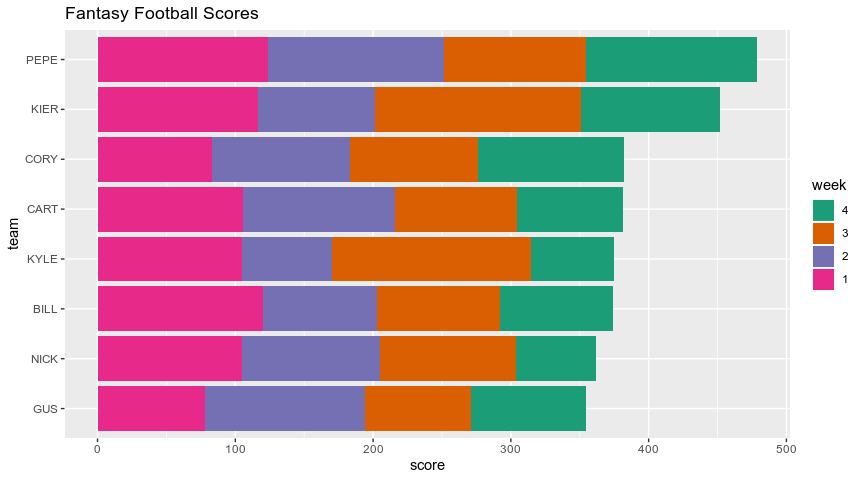

<!-- README.md is generated from README.Rmd. Please edit that file -->

# fflr

<!-- badges: start -->

[](https://www.tidyverse.org/lifecycle/#experimental)
[](https://CRAN.R-project.org/package=fflr)
<!-- badges: end -->

The `fflr` package is used to query the [ESPN Fantasy Football
API](https://fantasy.espn.com/apis/v3/games/ffl/), (for both the current
andpast seasons) and format the results into [*tidy* data
frames](https://vita.had.co.nz/papers/tidy-data.pdf).

## Installation

You can install the released version of `fflr` from
[GitHub](https://github.com) with:

``` r
# install.packages("remotes")
remotes::install_github("kiernann/fflr")
```

## Usage

``` r
library(tidyverse)
library(magrittr)
library(fflr)

lid <- extract_lid("https://fantasy.espn.com/football/team?leagueId=252353&teamId=6")
data <- fantasy_data(lid, view = "mMatchup")
scores <- map_df(data$schedule, weekly_matchup)

teams <- fantasy_members(lid) %>% 
  use_series(teams) %>%
  map_dfr(as_tibble) %>% 
  select(team = id, abbrev)

left_join(scores, teams) %>%
  filter(score != 0) %>% 
  mutate(week = fct_rev(as_factor(week))) %>% 
  ggplot(aes(x = reorder(abbrev, score), y = score)) +
  geom_col(aes(fill = week)) +
  scale_fill_brewer(palette = "Dark2") +
  labs(title = "Fantasy Football Scores", x = "team") +
  coord_flip()
```


