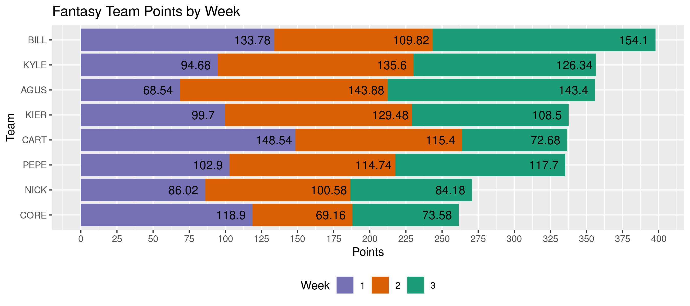

<!-- README.md is generated from README.Rmd. Please edit that file -->

# fflr 

<!-- badges: start -->

[](https://www.tidyverse.org/lifecycle/#maturing)
[](https://CRAN.R-project.org/package=fflr)
[](https://codecov.io/gh/kiernann/fflr?branch=master)
[](https://github.com/kiernann/fflr/actions)
<!-- badges: end -->

The fflr package is used to query the [ESPN Fantasy Football
API](https://fantasy.espn.com/apis/v3/games/ffl/) for both the current
and prior seasons. Get data on fantasy league members, teams, and
individual athletes.

This package was designed and tested for my own 10-man standard league.
Most functions should for other leagues, but contributions are welcome.

## Installation

You can install the released version of `fflr` from
[GitHub](https://github.com/kiernann/fflr) with:

``` r
# install.packages("remotes")
remotes::install_github("kiernann/fflr")
```

## Usage

Here we see how to scrape teams, rosters, scores, and waiver pickups.

Define your *public* league ID (from the URL) with `options()`.

<pre>
https://fantasy.espn.com/football/league?leagueId=<b>252353</b>
</pre>

``` r
library(fflr)
library(ffplot)
library(tidyverse)
options(lid = 252353)
```

``` r
rosters <- team_roster(week = ffl_week(-1))
my_roster <- rosters[[5]]
```

    #> # A tibble: 16 x 13
    #>     week team  slot  first    last        pro   pos   status  proj score start  rost  change
    #>    <int> <fct> <fct> <chr>    <chr>       <fct> <fct> <chr>  <dbl> <dbl> <dbl> <dbl>   <dbl>
    #>  1     5 KIER  QB    Gardner  Minshew II  Jax   QB    A      19.4  19.8  34.1   60.6   4.54 
    #>  2     5 KIER  RB    Alvin    Kamara      NO    RB    A      16.4  11.9  15.7   99.9  -0.02 
    #>  3     5 KIER  RB    Mike     Davis       Car   RB    A      14.1  20.9  95.2   97.4   2.66 
    #>  4     5 KIER  WR    DeAndre  Hopkins     Ari   WR    A      11.6  19.1  99.6   99.9  -0.001
    #>  5     5 KIER  WR    Odell    Beckham Jr. Cle   WR    A       9.27  6.42 84.0   98.6  -0.034
    #>  6     5 KIER  TE    Travis   Kelce       KC    TE    A      10.8  16.8  99.5  100.   -0.001
    #>  7     5 KIER  FX    David    Johnson     Hou   RB    A      12.9  10.3  74.6   96.3  -0.788
    #>  8     5 KIER  DS    Rams     D/ST        LAR   DS    A       5.79 12.5  74.7   86.3  -0.064
    #>  9     5 KIER  PK    Rodrigo  Blankenship Ind   PK    A       9.49 11    78.9   83.5   0.157
    #> 10     5 KIER  BE    Cooper   Kupp        LAR   WR    A       9.40  6.6  78.6   97.2  -0.387
    #> 11     5 KIER  BE    Jonathan Taylor      Ind   RB    A      12.4  13.4  79.6   97.3  -0.42 
    #> 12     5 KIER  BE    David    Montgomery  Chi   RB    A       9.83 11.9  70.4   92.9   2.46 
    #> 13     5 KIER  BE    Ronald   Jones II    TB    RB    A      11.9  12.5  57.9   90.3   0.63 
    #> 14     5 KIER  BE    Myles    Gaskin      Mia   RB    A       9.46 15.1  76.0   87.9   9.33 
    #> 15     5 KIER  BE    Joe      Burrow      Cin   QB    A      16.9   4.32  9.45  49.0 -18.6  
    #> 16     5 KIER  BE    Zach     Ertz        Phi   TE    Q       7.45  0.6  77.0   96.9  -2.02

``` r
my_best <- best_roster(my_roster)
roster_score(my_roster)
#> [1] 128.76
roster_score(my_best)
#> [1] 135.24
```

Matchups return as a [tidy](https://en.wikipedia.org/wiki/Tidy_data)
tibble of weekly scores by team.

``` r
(teams <- league_teams()[, -4])
#> # A tibble: 8 x 4
#>    year  team abbrev name                    
#>   <int> <int> <fct>  <chr>                   
#> 1  2020     1 AGUS   Obi-Wan Mahomey         
#> 2  2020     3 PEPE   JuJu's Bizarre Adventure
#> 3  2020     4 BILL   Bill's Fantasy Team     
#> 4  2020     5 CART   Ashley Mattison         
#> 5  2020     6 KIER   The Nuklear Option      
#> 6  2020     8 CORE   BIG TRUZZZ              
#> 7  2020    10 NICK   The Silence Of The Lamb 
#> 8  2020    11 KYLE   Ashley Hill
scores <- match_scores()
```

This makes scores over the season easy to plot. The **experimental**
[ffplot](https://github.com/kiernann/ffplot) package makes such plots
automatically.



Some functions like `roster_moves()` only define players by their unique
ID.

``` r
waiver_adds <- 
  roster_moves(week = 3) %>% 
  filter(
    type == "WAIVER", 
    status == "EXECUTED",
    move == "ADD"
  )
```

The included `nfl_players` tibble identifies all 1062 players (as of
September 30th, 2020).

``` r
waiver_adds %>% 
  left_join(nfl_players[, 1:3]) %>% 
  select(15:16, bid, team = to_team) %>%
  left_join(teams[, 2:3]) %>% 
  arrange(desc(bid))
#> # A tibble: 19 x 5
#>    first      last            bid  team abbrev
#>    <chr>      <chr>         <int> <int> <fct> 
#>  1 James      Robinson         32     4 BILL  
#>  2 Joshua     Kelley           16     4 BILL  
#>  3 Jonnu      Smith             7     1 AGUS  
#>  4 Mike       Gesicki           6     5 CART  
#>  5 Gardner    Minshew II        5     6 KIER  
#>  6 Buccaneers D/ST              5     1 AGUS  
#>  7 Jarvis     Landry            5     8 CORE  
#>  8 Darius     Slayton           5     1 AGUS  
#>  9 Mike       Davis             4     6 KIER  
#> 10 Colts      D/ST              4    11 KYLE  
#> 11 Darrell    Henderson Jr.     3     8 CORE  
#> 12 Zane       Gonzalez          3     1 AGUS  
#> 13 Russell    Gage              2    10 NICK  
#> 14 Devonta    Freeman           2     8 CORE  
#> 15 Dallas     Goedert           1    10 NICK  
#> 16 Washington D/ST              1     5 CART  
#> 17 Jason      Myers             1    11 KYLE  
#> 18 Deebo      Samuel            1     6 KIER  
#> 19 Jerick     McKinnon          1     4 BILL
```

-----

The fflr project is released with a [Contributor Code of
Conduct](https://kiernann.com/fflr/CODE_OF_CONDUCT.html). By
contributing to this project, you agree to abide by its terms.

<!-- refs: start -->

<!-- refs: end -->
