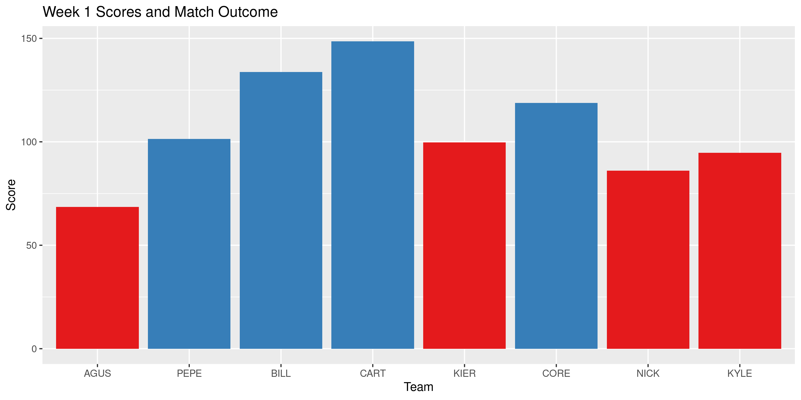

<!-- README.md is generated from README.Rmd. Please edit that file -->

# fflr 

<!-- badges: start -->

[](https://www.tidyverse.org/lifecycle/#experimental)
[](https://CRAN.R-project.org/package=fflr)
[](https://codecov.io/gh/kiernann/fflr?branch=master)
 [](https://github.com/kiernann/fflr/actions)
<!-- badges: end -->

The fflr package is used to query the [ESPN Fantasy Football
API](https://fantasy.espn.com/apis/v3/games/ffl/) for both the current
and prior seasons. Get data on fantasy league members, teams, and
individual athletes.

## Installation

You can install the released version of `fflr` from GitHub with:

``` r
# install.packages("remotes")
remotes::install_github("kiernann/fflr")
```

## Usage

The fflr package can be used to scrape team rosters, weekly matchups,
draft pick history, and even calculate the optimal scoring roster.

``` r
library(fflr)
rosters <- team_roster(252353, week = 1)
rosters[[5]][, -5]
#> # A tibble: 16 x 14
#>     year  week  team slot  first     last        pro   pos   status  proj score  start  rost change
#>    <int> <int> <int> <fct> <chr>     <chr>       <chr> <fct> <chr>  <dbl> <dbl>  <dbl> <dbl>  <dbl>
#>  1  2020     1     6 QB    Drew      Brees       NO    QB    A      17.5   14.4 0.569  0.940 -0.174
#>  2  2020     1     6 RB    Alvin     Kamara      NO    RB    A      14.0   18.7 0.996  0.999  0.033
#>  3  2020     1     6 RB    David     Johnson     HOU   RB    A      12.2   16.9 0.874  0.984  0.449
#>  4  2020     1     6 WR    DeAndre   Hopkins     ARI   WR    A       9.73  15.1 0.992  0.999  0.03 
#>  5  2020     1     6 WR    Odell     Beckham Jr. CLE   WR    A       9.09   2.2 0.843  0.994  0.013
#>  6  2020     1     6 TE    Travis    Kelce       KC    TE    A      11.3   11   0.997  0.999  0.028
#>  7  2020     1     6 FX    Jonathan  Taylor      IND   RB    A       9.25   8.9 0.499  0.955  0.19 
#>  8  2020     1     6 DS    Steelers  D/ST        PIT   DS    <NA>    7.03   8.5 0.957  0.995  0.065
#>  9  2020     1     6 KI    Greg      Zuerlein    DAL   KI    A       7.53   4   0.866  0.926 -1.09 
#> 10  2020     1     6 BE    Cooper    Kupp        LAR   WR    A       8.79   4   0.825  0.982  0.267
#> 11  2020     1     6 BE    D'Andre   Swift       DET   RB    A       5.58   8.3 0.128  0.889 -2.81 
#> 12  2020     1     6 BE    David     Montgomery  CHI   RB    A       8.55   7.4 0.185  0.908 -0.835
#> 13  2020     1     6 BE    Christian Kirk        ARI   WR    A       6.73   0   0.0729 0.781 -0.189
#> 14  2020     1     6 BE    Ronald    Jones II    TB    RB    A       7.94   8.2 0.173  0.873 -1.18 
#> 15  2020     1     6 BE    Marvin    Jones Jr.   DET   WR    A       9.23   5.5 0.302  0.899 -0.218
#> 16  2020     1     6 BE    Deebo     Samuel      SF    WR    I       0      0   0.0180 0.841 -3.38
```

``` r
best_roster(rosters[[5]][, -5])
#> # A tibble: 9 x 14
#>    year  week  team slot  first    last      pro   pos   status  proj score start  rost change
#>   <int> <int> <int> <fct> <chr>    <chr>     <chr> <fct> <chr>  <dbl> <dbl> <dbl> <dbl>  <dbl>
#> 1  2020     1     6 QB    Drew     Brees     NO    QB    A      17.5   14.4 0.569 0.940 -0.174
#> 2  2020     1     6 RB    Alvin    Kamara    NO    RB    A      14.0   18.7 0.996 0.999  0.033
#> 3  2020     1     6 RB    David    Johnson   HOU   RB    A      12.2   16.9 0.874 0.984  0.449
#> 4  2020     1     6 WR    DeAndre  Hopkins   ARI   WR    A       9.73  15.1 0.992 0.999  0.03 
#> 5  2020     1     6 WR    Marvin   Jones Jr. DET   WR    A       9.23   5.5 0.302 0.899 -0.218
#> 6  2020     1     6 TE    Travis   Kelce     KC    TE    A      11.3   11   0.997 0.999  0.028
#> 7  2020     1     6 FX    Jonathan Taylor    IND   RB    A       9.25   8.9 0.499 0.955  0.19 
#> 8  2020     1     6 DS    Steelers D/ST      PIT   DS    <NA>    7.03   8.5 0.957 0.995  0.065
#> 9  2020     1     6 KI    Greg     Zuerlein  DAL   KI    A       7.53   4   0.866 0.926 -1.09
```

``` r
(teams <- league_teams(252353))
#> # A tibble: 8 x 5
#>    team abbrev owners                                 name                      year
#>   <int> <chr>  <chr>                                  <chr>                    <int>
#> 1     1 AGUS   {12E61406-349A-4DC7-A614-06349AADC797} Obi-Wan Mahomey           2020
#> 2     3 PEPE   {5FA14794-6573-4189-A147-9465737189B2} JuJu's Bizarre Adventure  2020
#> 3     4 BILL   {91F8B424-1689-472E-B8B4-241689172E35} Green Akers               2020
#> 4     5 CART   {F33F0723-2CC3-4A1C-BF07-232CC34A1C15} Kenyan Younghoes          2020
#> 5     6 KIER   {22DFE7FF-9DF2-4F3B-9FE7-FF9DF2AF3BD2} The Nuklear Option        2020
#> 6     8 CORE   {9A722A48-6E16-42BC-9E0E-AC9E4E6D7ABC} Action Jackson            2020
#> 7    10 NICK   {35D9B7DB-E821-453C-99B7-DBE821353C36} Kareemy Johnson           2020
#> 8    11 KYLE   {C61F403A-F689-4269-879E-145B897F2308} Harry Ruggs               2020
scores <- weekly_matchups(252353)
```



-----

The fflr project is released with a [Contributor Code of
Conduct](https://contributor-covenant.org/version/1/0/0/CODE_OF_CONDUCT.html).
By contributing to this project, you agree to abide by its terms.

<!-- refs: start -->

<!-- refs: end -->
